# Zeplin Onboarding Workbook! 

We've crafted a Zeplin onboarding workbook to make it easy for you to define your team's developer/designer collaboration process.

- [Zeplin Workbook 📚](#zeplin-guide-)

- [Zeplin Workbook for developers 💻](#zeplin-guide-for-developers-️-)

Let us know your feedback, we ❤️to [hear it]("mailto:support@zeplin.io"). 

-Zeplin Crew
 

---
 
# Zeplin Guide 📚

##### Legend: 💡: Pro-tip

## Complete these steps

- [ ] Fill out all the fields below marked with ⚠️#TODO with your Design and Development lead
- [ ] Copy .md file into your wiki

>💡Remove any section(s) of this workbook that are not helpful/applicable to your process

## Quick Reference  
|   Role     |  Contact ⚠️#TODO |
| ------------------- |:---------------------------|
| Zeplin Admin      | _todo@domain.com_    |
| Design Contact    | _todo@domain.com_                     |
| Development Contact | _todo@domain.com_                   |
| Web Contact           | _todo@domain.com_                 |

## Getting Access to Zeplin

1. Send request to Zeplin Admin(s), see [Quick Reference](#quick-reference) above.

2. Create a [**Zeplin account**](https://app.zeplin.io/register) with your work email. 

3. Download Zeplin ↓

|Platform        |     Access        |    
| :------------- |:-------------|
| Web      | [app.zeplin.io](https://app.zeplin.io)  | [Supported Versions](https://support.zeplin.io/faq/supported-versions)  |
| macOS      | Download [\[64-bit\]](https://zpl.io/download-mac) | 
| Windows | Download [\[32-bit\]](https://zpl.io/download-windows-32) [\[64-bit\]](https://zpl.io/download-windows-64) |  

[**Supported OS & Web Versions**](https://support.zeplin.io/faq/supported-versions) 💻

### Desktop vs. Web app
The Zeplin Web app has access everything you need. 
Zeplin has macOS and Windows desktop apps, however these are not _required_ unless you're:
* Importing designs into Zeplin
* Using Zeplin [Pop-out](https://support.zeplin.io/zeplin-101/comparing-appwebsite-with-designs-using-pop-out) feature to overlay the designs on your simulator

## Project Naming Convention

### Guide
Once your team starts using Zeplin, it’s common for your dashboard to have hundreds of projects. Establishing a [roject naming convention enhances visibility of projects and discoverability.

**Naming:** Use vocabulary that’s familiar to your team like team, group, platform, project, feature, epic name.

>_ex. StartupInc Experience-iOS-Check-out_

**Thumbnail:** Add a thumbnail to your project that makes it easy to distinguish platform type (Web, iOS, Android) or team.

_ex. 

_ex. Some teams color code thumbnails like this; for iOS, Web, Android_
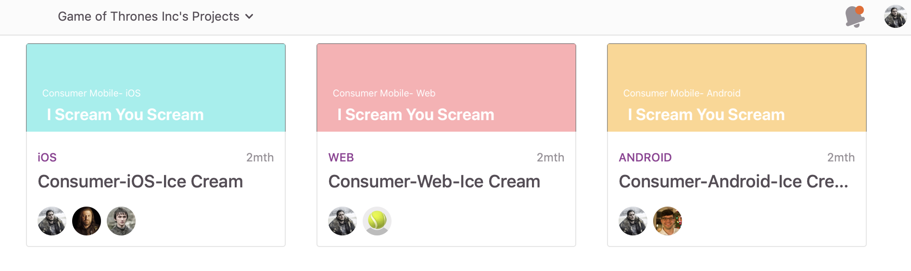

### Project Naming Convention 

|   Type     | Content ⚠️#TODO | Example ⚠️#TODO
| ------------------- |:-------------|:-------------|
| Naming Convention    |   _[Team/brand name] - [platform] - [feature]_ |    _Airbnb Experience-iOS-Check-out_   |

                                    Sample thumbnail image ⚠️#TODO

## Project Structure

Having a standard project structure helps other team members effectively navigate through your project especially your developer counterpart.

**Project Description:** Add links to documentation and relevant stakeholders.

**Sections:** Group screens by user flow, features or epics.

**Section Descriptions:** Brief description of each section.

**Screen Tags:** Group screens by design stage, team names, date, version or screen type like Empty State or Pop-up.
 

|   Type     | Content ⚠️#TODO | Example ⚠️#TODO
| ------------------- |:-------------|:-------------|
| We will use Project Descriptions to describe    |   _What is the purpose of this project_        |  _This interface shows our cargo assets in the field_     |
| We will group Screens into Sections by    |  _User interaction_  |   _Login flow_   |
| We will use Section Description to describe    | _User experience, what is the user doing here_ |   _This is where the user will check out their cart_     |
| We will group Screens with tags by    |  _What state it's in_ |  _ready for development, needs design, needs dev, needs legal_     |

## Sharing Projects
Having a standard and clear way to share screens reduce unnecessary back and forth or any chances of miscommunication.

**Links:** Link to a specific set of screens using Tags or Sections.

**Sharing:** Choose a standard channel to share links like Slack, Github, and Jira

#### Sharing Links 

|   Type     | Location  ⚠️#TODO
| ------------------- |:-------------|
| We will use group and share links using  | _Sections_ |
| We will share our links in    |  _Github_  | 

## Layers
Layer units are specific to the Zeplin project type (Web, iOS, Android).

|Platform        | Unit  |
| ------------- |:-------------|
| iOS      | pt |
| Android      | dp     |
| Web | px |

## Extensions & Code Snippets
All code snippets in Zeplin are generated using extensions. Some are platform specific, and some are platform generic. These will be used by your developers to implement your designs.

Developers can write their own if they wish, [read more](https://github.com/zeplin/zeplin-extension-documentation) about Zeplin extensions. 

## Notes & Commenting

### Commenting

You can quickly add a note by Cmd + Clicking (Ctrl for Windows and Linux users) anywhere on the screen. You can even mention other teammates with “@” and they will receive a notification.

If you're tagged in a  note, you can resolve that note.

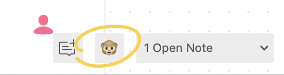
>💡Show/hide notes on a design by clicking the 🙈 icon

### Colors 
Use color to indicate the type of note you are leaving or the status of a notes:
ex.)

|Color        | Example  |
| ------------- |:-------------|
| **Green**     | _Designer adding details like describing animations_ |
| **Orange**    |  _Developer roadblock or requesting changes to design_  |
| **Red**       |  _PM team feedback_  |
| **Green**     |  _Accessibility review pending_  |

### Color Assignment  
|Color        | Usage ⚠️#TODO   |
| ------------- |:-------------|
| Yellow    |    |
| Orange    |    |
| Red       |    |
| Green     |    |
| Cyan      |    |
| Blue      |    |
| Purple    |    |

## Versions (history)

**Commit Message:** add descriptive message to clarify changes. 

>_ex. Color change to #FFFFFF in profile background_ 

**Color:** use it to indicate type of version.

**Delete versions:** Frequent exports to Zeplin can clutter version history, be sure to either leave commit messages or delete versions.

#### Version Color Assignment 
|Version Color        | Usage ⚠️#TODO    |
| ------------- |:-------------|
| Yellow    |    |
| Orange    | _Pending_   |
| Red       | _Experiment_   | 
| Green     | _Approved_   | 
| Cyan      |    |
| Blue      |    |
| Purple    |    |
 
>💡For more best practices leveraging Versions see this [article](https://blog.zeplin.io/versions-in-zeplin-a8465ee441c2).

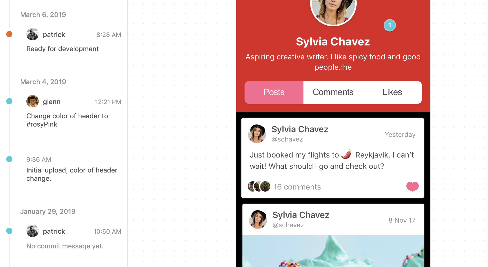

## Slack Integration 

**#channel:** Create a channel in Slack and connect it to your specific Zeplin project. Channels can be based on features, team etc.
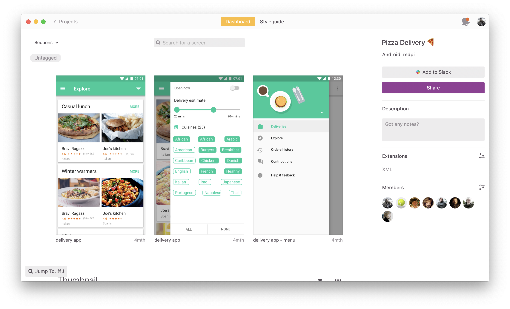

**Notification settings:** In the Zeplin web app you can filter notifications. We recommend to enable only key notification types to prevent noise.
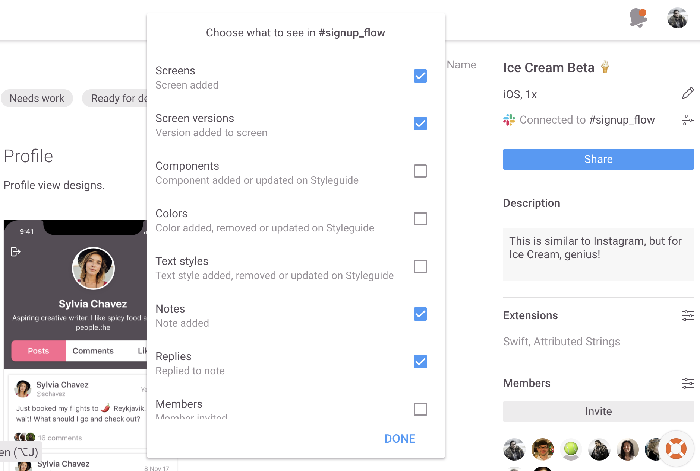   

|Desription        | Location ⚠️#TODO
| ------------- |:-------------|
|We will create a Slack channel for these type of projects      | _link to slack channel_ |

We will enable slack notifications for: 

|Notification        | Enabled ⚠️#TODO  |
| ------------- |:-------------|
| Screens      | ✅ |
| Screen Versions      | ✅     |
| Colors |✅ |
| Components | ✅ |
| Text Styles | ✅ |
| Notes | ✅ |
| Replies | ✅ |
| Members | 🚫 |
| Extensions | ✅ |
| Project Status | ✅ |

## Links
- [Zeplin Knowledge Base](https://support.zeplin.io/)
- [Zeplin Project home](https://app.zeplin.io)

>Questions / Comments / Meaning of life : support@zeplin.io
---
 

# Zeplin Guide for Developers ⚗️ 📚 

##### Legend: 💡: Pro-tip

## Welcome to Zeplin
Zeplin is a designer/developer collaboration tool. Designers upload their artboards/screens via their preferred design program (Sketch, Figma, Adobe XD, Adobe Photoshop) into Zeplin. Team members in Zeplin can view designs, make comments, tag others, view layer data, code snippets, components, and download image assets. 

Zeplin acts as a source of truth for development to implement in a connected space, encouraging collaboration by all project stakeholders. 

>💡 Zeplin helps make your design, development, and collaboration life easier. 

## Getting Access to Zeplin

1. Send request to Zeplin Admin(s).

2. Create a [**Zeplin account**](https://app.zeplin.io/register) with your work email. 

3. Download Zeplin ↓

|Platform        |     Access        |    
| :------------- |:-------------|
| Web      | [https://app.zeplin.io](https://app.zeplin.io)  | [Supported Versions](https://support.zeplin.io/faq/supported-versions)  |
| macOS      | Download [\[64-bit\]](https://zpl.io/download-mac) | 
| Windows | Download [\[32-bit\]](https://zpl.io/download-windows-32) [\[64-bit\]](https://zpl.io/download-windows-64) |  

[**Supported OS & Web Versions**](https://support.zeplin.io/faq/supported-versions) 💻
>💡 Keyboard shortcuts: [Mac](https://support.zeplin.io/tips-and-tricks/keyboard-shortcuts-for-the-mac-app) / [Web](https://support.zeplin.io/tips-and-tricks/keyboard-shortcuts-for-the-windows-and-web-app) / [PC](https://support.zeplin.io/tips-and-tricks/keyboard-shortcuts-for-the-windows-and-web-app)

### Desktop vs. Web app
The Zeplin Web app has access everything you need. 
Zeplin has macOS and Windows desktop apps, however these are not _required_ unless you're:
* Importing designs into Zeplin
* Using Zeplin [Pop-out](https://support.zeplin.io/zeplin-101/comparing-appwebsite-with-designs-using-pop-out) feature to overlay the designs on your simulator

>💡Zeplin Web works on Linux

## Zeplin Projects
Zeplin projects are created by the design team and are specific to the platform you're developing for. 

|Project Type   |
| ------------- |
| iOS           | 
| Android       | 
| Web           | 
| macOS         | 

Each project has a dashboard 

>💡Dashboard keyboard shortcut

>💡Styleguide keyboard shortcut

## Sharing project URIs ([read more](https://support.zeplin.io/zeplin-101/sharing-app-uris))
Links to projects in Zeplin will open in the Web or Desktop App
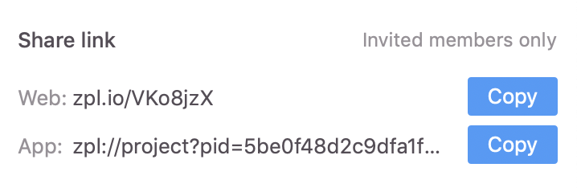

## Team Collaboration ([read more](https://support.zeplin.io/quick-start/collaborating-with-your-team))

### Commenting

You can quickly add a note by Cmd + Clicking (Ctrl for Windows and Linux users) anywhere on the screen. You can even mention other teammates with “@” and they will receive a notification.

If you're tagged in a  note, you can resolve that note.

>💡Show/hide notes on a design by clicking the 🙈 icon

## Layers
Layer units are specific to the Zeplin project type (Web, iOS, Android).

|Platform        | Unit  |
| ------------- |:-------------|
| iOS      | pt |
| Android      | dp     |
| Web | px |

### Measurements 
By clicking on an element you can see its size. Once clicked you can move your mouse around and see spacing it is from other elements. Additionally, on the right panel, any assets, colors, coordinates, and code markup such as CSS (if Zeplin project type is Web) will be present.

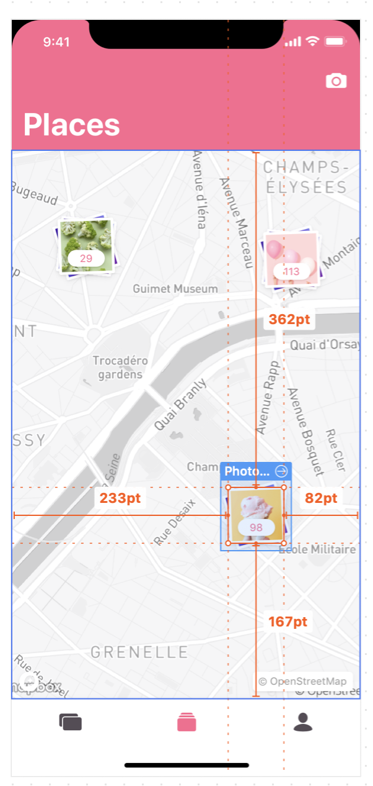

>💡Hold "alt" to see relative distances instead of discrete values.

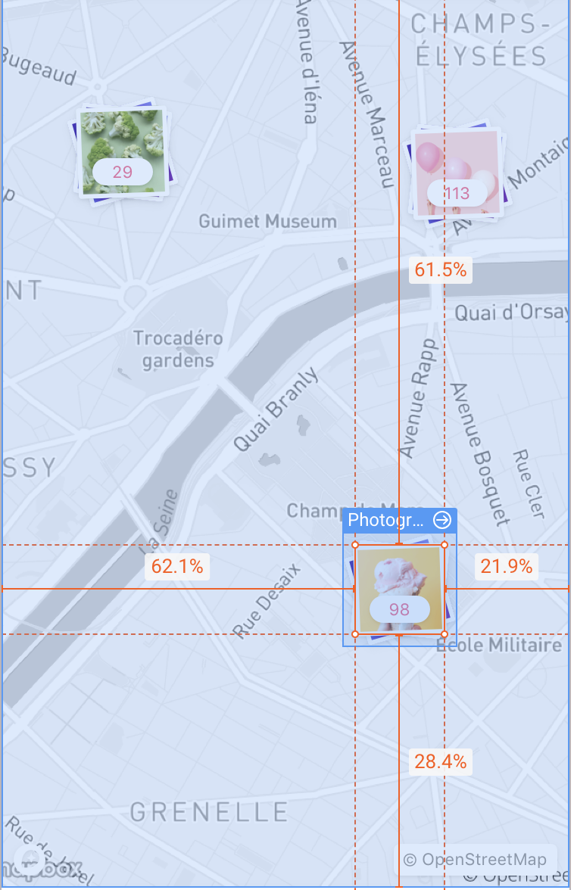

## Styleguide
>💡Quickly navigate to your project's Stylguide with [Command + G] (macOS), [⌥ + S \ Alt + S] (PC /Web)

### Colors
>💡Using color variables

>💡[Change color formats](https://support.zeplin.io/zeplin-101/changing-color-formats) RGB, ARGB or Hex

### Text Styles
#GlennTODO

### Components

Components are reusable elements imported from your team's preferred design tools into Zeplin. 

|  Design Tool     |    Native Component name        | 
| ------------- |-------------| 
| Sketch [[read more](https://support.zeplin.io/sketch-integration/exporting-components-from-sketch)]       | Symbols  | 
| Figma [[read more](https://support.zeplin.io/figma-integration/exporting-components-from-figma)]     | Components |
| XD ⚠️ [_coming soon_] | Symbols  |

When the team exports their symbols/components from their design tool into Zeplin, you'll be able to easily identify elements that are components. For any element that is a component, you can see a blue header on that element, in addition to a link to that component in the sidebar (_see image below_).

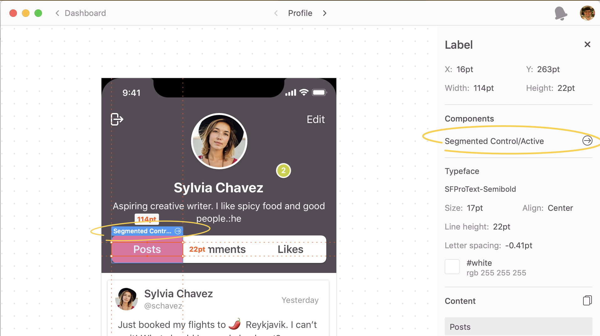

### Assets 

>💡 If you cannot download assets for a screen, remind your designers to mark those elements as exportable in their design tool. If they are marked as exported and imported into Zeplin, you'll then be able to download them! 

Like layer data, Zeplin tailors assets to the platform your project is set to. The designers on your team will need to mark the assets you need to download from Zeplin as "exportable". 

If an image is marked as exportable, Zeplin automatically provides the resources in  **1x 2x 3x densities**. ✨

|Platform        | Unit  |
| ------------- |:-------------|
| iOS      | PNG / PDF |
| Android      | PNG / SVG      |
| Web | PNG / SVG |

>💡[Download ALL assets](https://support.zeplin.io/zeplin-101/downloading-all-available-assets-in-a-screen) for any screen by clicking on the "knife" icon

>💡 If you want to use your own optimization tools, SVGO optimization is configurable (on / off) in Zeplin.

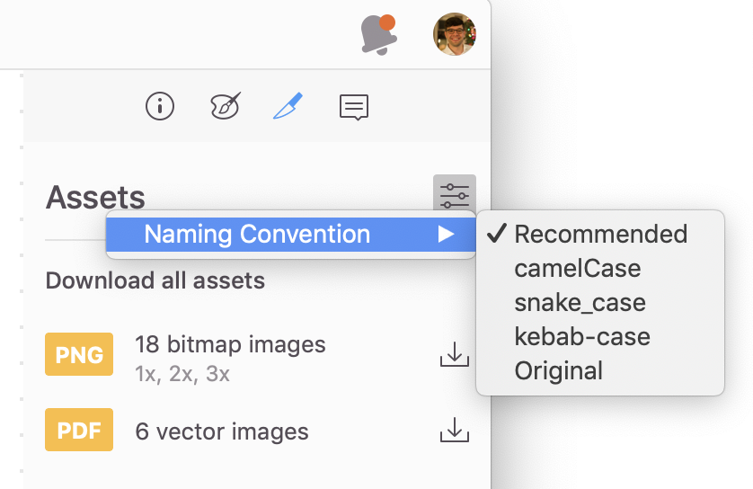

>💡 Asset naming convention is configurable (camelCase / snake_case / kebab-case).

>💡You can rename assets, keep in mind that this will apply only locally. 

### **iOS** ([read more](https://support.zeplin.io/zeplin-101/developing-ios-projects-using-zeplin))

- PNG, PDF image types available
- Asset Catalog Colors ([read more](https://blog.zeplin.io/asset-catalog-colors-on-xcode-9-c4fdccc0381a))
- Export project color palette (from the project Styleguide) directly to your asset catalog (Xcode 9 and up). For more details, check out the blog post for this feature.
- Measurements are in points.
- UIColor/UIFont extensions on Swift or Objective-C, from the project Styleguide.
- When you first export assets into .xcassets  directory of your project, images are added to the appropriate directories and assets are added to your project. Next time you export another asset, you can simply select the project.
- Export project color palette (from the project Styleguide) directly to your asset catalog (Xcode 9 and up). For more details, check out the [blog post](https://blog.zeplin.io/asset-catalog-colors-on-xcode-9-c4fdccc0381a) for this feature.

### **Android** ([read more](https://support.zeplin.io/zeplin-101/developing-android-projects-using-zeplin))

- Measurements are in dp/sp.
- Assets are available as 5 PNGs (mdpi, hdpi, xhdpi, xxhdpi, xxxhdpi) and SVGs. Vector Drawables are on the way!
- XMLs from project color palette and text styles, from the project Styleguide.
- TextView  code snippets from text layers.

### **Web** ([read more](https://support.zeplin.io/zeplin-101/developing-web-projects-using-zeplin))
Measurements are in pixels. Assets are available as 3 PNGs (1x, 2x, 3x), SVGs and optimized SVGs (with SVGO). Bitmap images are also available as 3 JPGs.

- CSS, Sass, SCSS, Less, Stylus snippets from layers, colors and text styles.
- Grids from layouts in Sketch, Figma and Photoshop are accessible, from the information tab.
- HTML snippets from assets.
- HTML snippets from layers that match text style names as HTML tags (like h1 , h2  and so on).

### Pop-out feature ([read more](https://support.zeplin.io/zeplin-101/comparing-appwebsite-with-designs-using-pop-out), _Zeplin Desktop required_)

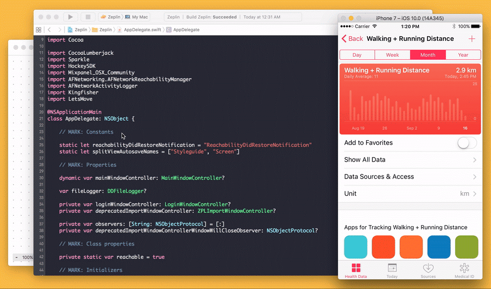

## Extensions & Code Snippets
Extensions are the mechanism Zeplin uses to generate code snippets. Some are platform specific, and some are platform agnostic. 

All Zeplin extensions are JavaScript modules that generate code snippets from various design elements. All code snippets you interact with in Zeplin are generated using extensions. Developers can write their own if they wish, [read more](https://github.com/zeplin/zeplin-extension-documentation) about Zeplin extensions.

#### [Adding extensions to projects](https://support.zeplin.io/zeplin-101/adding-an-extension-to-a-project)

- [CSS/HTML](https://support.zeplin.io/faq/exporting-css-and-html)
- [SCSS](https://github.com/zeplin/stylesheet-extensions)
- [React Native](https://support.zeplin.io/zeplin-101/exporting-react-native-code-snippets)
- [Sass](https://extensions.zeplin.io/zeplin/sass)
- [Xamarin Forms](https://extensions.zeplin.io/goldnarms/zeplin-extension-xamarin)
- [JSON Design Tokens](https://extensions.zeplin.io/berk/zeplin-json-extension)

### Build your own Extension
Zeplin extension manager ([**zem**](https://github.com/zeplin/zem)), is a command line tool that lets you quickly create and test extensions.

Follow the [zem tutorial](https://github.com/zeplin/zeplin-extension-documentation/blob/master/tutorial.md#adding-a-local-extension) to start building your own Zeplin custom extension.
>💡If you'd like to build a new Zeplin Extension, reach out to glenn@zeplin.io

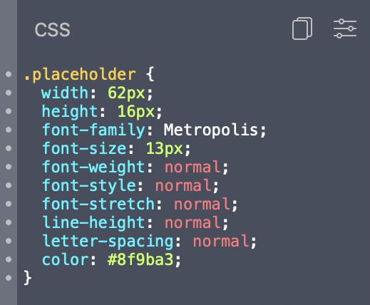

## Prototyping / User flow links ([read more](https://blog.zeplin.io/flows-in-zeplin-round-one-c56550f23f0f))

When you export your artboards with links to Zeplin, these links will be clickable in Zeplin as well, with no additional setup. Selecting a layer below a hotspot will inform the user and present a button on the right panel to quickly jump to the destination.

>💡 When you hold down the Shift key all the hotspots/prototyping will be revealed

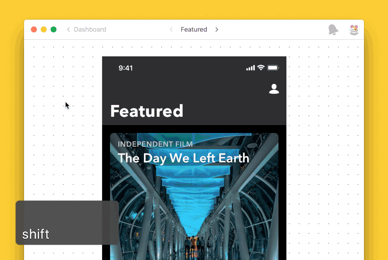

## Versions

>💡For more best practices check this [article](https://blog.zeplin.io/versions-in-zeplin-a8465ee441c2).

## Integrations 

### Integration with Slack ([read more](https://support.zeplin.io/zeplin-101/keep-up-to-date-on-your-projects-with-the-slack-integration))

### Integration with Trello ([read more](https://support.zeplin.io/zeplin-101/enabling-the-zeplin-power-up-on-trello))
The Zeplin Power-up on Trello lets you attach your projects, screens and tags to Trello cards, to preview and quickly access them. You can also paste Zeplin links directly to comments, card descriptions and they’ll be infinitely more meaningful.

## Q / A 

**Q**: Why are my specs off? 

**A:** Designer might have set the density of the project incorrectly. They can correct this setting [here](https://support.zeplin.io/zeplin-101/choosing-the-correct-project-type-and-density).

## Links
- [Zeplin Knowledge Base](https://support.zeplin.io/)
- [Zeplin Project home](https://app.zeplin.io)

>Questions / Comments / Meaning of life : support@zeplin.io